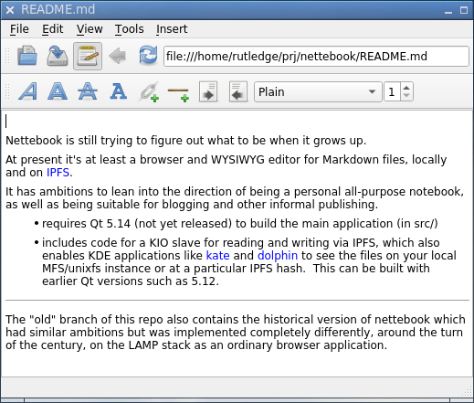
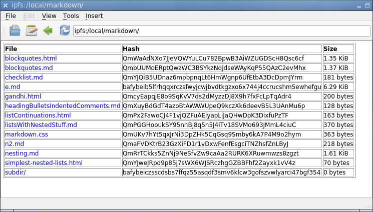
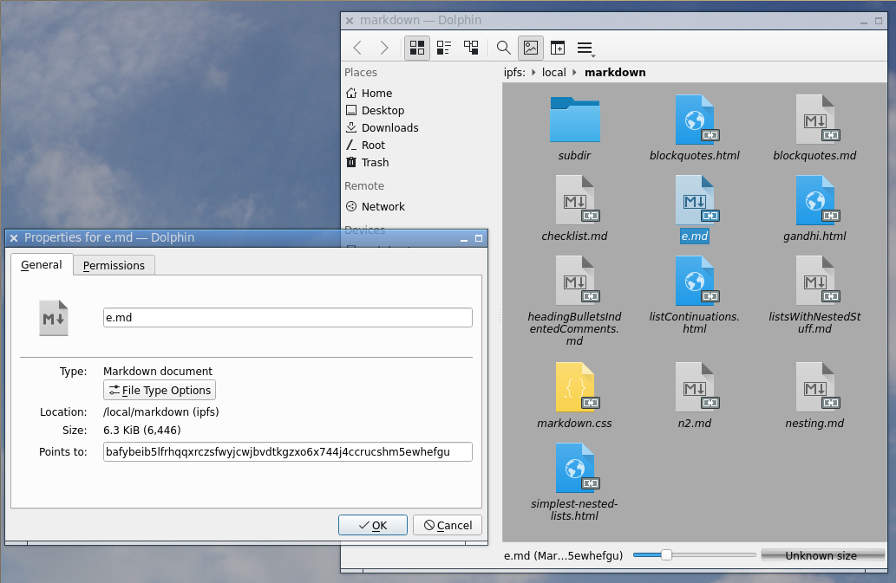

Nettebook is still trying to figure out what to be when it grows up.

At present it's at least a browser and WYSIWYG editor for Markdown files,
locally and on [IPFS](https://ipfs.io).

It has ambitions to lean into the direction of being a personal all-purpose
notebook, as well as being suitable for blogging and other informal publishing.

- requires Qt 5.14 (not yet released) to build the main application (in src/)
- includes code for a KIO slave for reading and writing via IPFS, which also
  enables KDE applications like [kate](https://kate-editor.org) and 
  [dolphin](https://kde.org/applications/system/org.kde.dolphin) to see the
  files on your local MFS/unixfs instance or at a particular IPFS hash.  This
  can be built with earlier Qt versions such as 5.12.

- - -
The "old" branch of this repo also contains the historical version of nettebook
which had similar ambitions but was implemented completely differently, around
the turn of the century, on the LAMP stack as an ordinary browser application.

